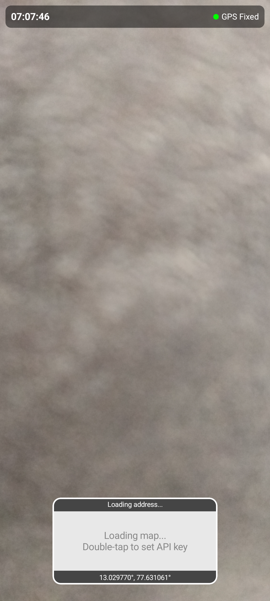
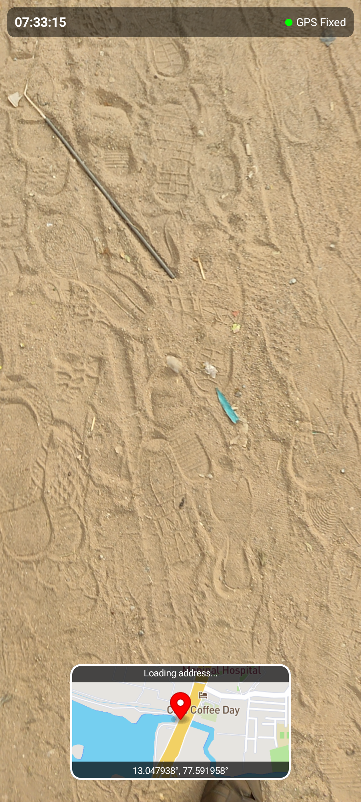

# Geotag Video Camera

A simple CameraX + Compose app that overlays a live map and location info on top of the camera preview.

  
  
    

  
  
  <!--  -->

  <!-- 
   -->
  <!-- 
   -->

> UI tip: Double‑tap anywhere on the preview to open Settings.

## Initial context

On first launch, if the app is using MapLibre demo tiles (the default fallback), you’ll see a one‑time notice:
- MapLibre demo tiles are for demonstration only since they do not show terrain.
- For better maps, use MapTiler or Geoapify and provide your API key.

To configure:
1. Double‑tap anywhere on the camera preview to open Settings.
2. Go to Settings → Map.
3. Pick a provider:
   - MapTiler: paste your API key in “MapTiler API key”.
   - Geoapify: paste your API key in “Geoapify API key”.
   - MapLibre: provide your own style URL if you self‑host tiles; otherwise the app will use demo tiles.
4. Optionally adjust the map zoom and overlay preferences.

If no key is provided for MapTiler/Geoapify or no custom style URL is set for MapLibre, the app falls back to MapLibre demo tiles.

## Highlights
- Live overlay: map + coordinates on the camera preview
- Works with MapLibre (default), MapTiler, or Geoapify
- Compose UI, clean controls; simple mode toggle
- Optional debug location for demos

## Quickstart
1) Open the app, double‑tap the preview → Settings.  
2) Settings → Map: choose a provider.  
   - MapTiler or Geoapify: paste your API key.  
   - MapLibre: use your own style URL, otherwise demo tiles are used.  
3) Frame your shot and record.

## Permissions
- Camera
- Location (for GPS overlays and reverse geocoding)
- Optional: notifications, audio (for future features)

## Notes
- Map tiles are fetched from the provider you select.
- When using demo tiles, terrain and detail may be limited.
- Location data is only embedded locally. No tracking or cloud uploads.

## Support
- Issues: https://github.com/mlm-games/mlm-games-geotag-video-camera/issues

## License
GPL‑3.0 — see [LICENSE](LICENSE).
